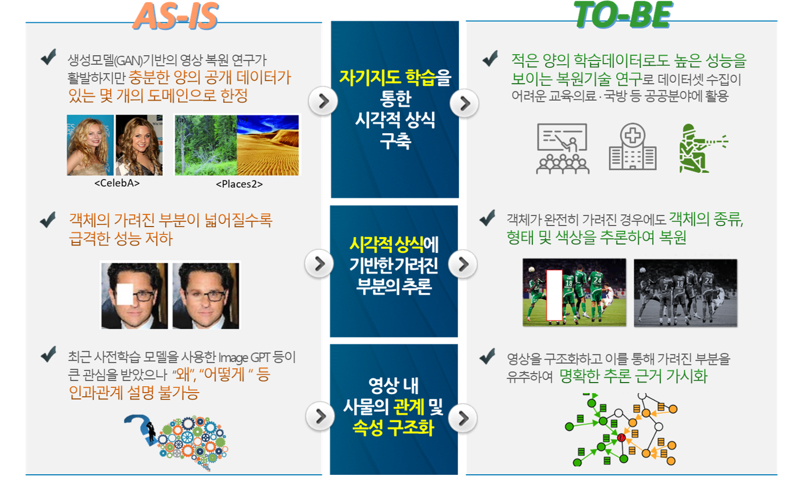

## 자기지도학습에 의한 시각적 상식으로 영상에서 보이지 않는 부분을 복원하는 기술

#### 정보통신/방송 기술개발사업, 차세대 인공지능 핵심원천기술개발

This work was supported by IITP/MSIT No. 2021-0-00537, Visual common sense through self-supervised learning for restoration of invisible parts in images.

홈페이지 링크 -> https://ssl-keti.github.io/

